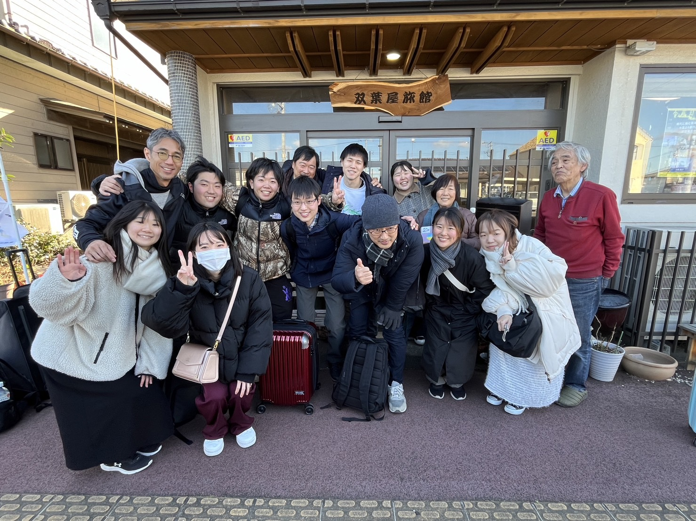

# About

“Tomoni” introduces students from Reitaku University and Tohoku University to come together in Odaka, Fukushima to conduct spatial research through deep ethnographic exploration with local community members. During this four day expedition (February 1-4, 2024), students were tasked to become humanists by exploring, participating and listening, and in doing so, to construct a “thick map” that incorporates data visualizations, documentary film, photographic documents, risk maps, journals, etc, all produced through community narratives. On the final day, students invited the community members they engaged with (and beyond) to participate in a forum where they presented their “thick maps” and engaged in a dialogue with participants.

#

“TOMONI”は、東日本大震災から13年が経とうとしている今日、麗澤大学と東北大学から学生が福島県小高町に集まり、地域コミュニティーの人びとと共同で、深いエスノグラフィックな探求を実施する探索的かつ教育的プロジェクトである。具体的には、4日間（2014年2月1日〜4日）の滞在の間に広義の文化人類学的な参与観察の手法によりデータを収集し、成果物としてデータビジュアライゼーション、ドキュメンタリーフィルム、写真資料、リスクマップ、観察日記など、コミュニティーの語りによって生み出されるすべてを盛り込んだ「分厚い地図（thick map）」を構築することが課される。その過程を通じて生じる調査者自身の間主観的な変化を注意深く観察し、記述することによって、参加学生のヒューマニストとしての成長を促す。地域の潜在的なニーズの創発を捉えるために、全体的にあえて非構造的なアプローチを採用した。最終日に学生たちは、自分たちが関わったコミュニティの人々（そしてそれ以外の人々）をフォーラムに招待し、そこで自分たちの「分厚い地図」を相互的なワークショップ形式で発表し、参加者との深い対話を試みる。

