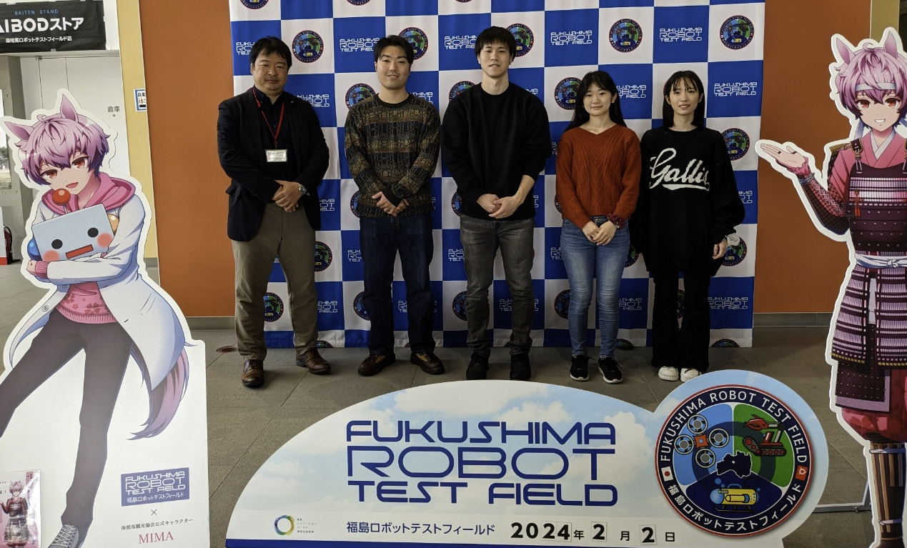

# Mao

## What did you do?

- 2月1日から４日までの４日間、福島県南相馬市の小高を中心に実地されたフィールドワークに参加した。
- ２月１日は浪江駅に集合し、道の駅なみえを探索したあと請戸小学校の見学を行い、双葉屋旅館にて参考動画の視聴をして、調査計画の打ち合わせをグループで行った。
- ２月２日はまず福島ロボットテストフィールドの見学を行ったあと、ワーカーズビレッジにて関係者の方にお話を伺い、日鷲神社の宮司さんにインタビューを行った。
- ２月３日は午前に双葉町にある伝承館を見学し、午後には大堀近辺などで放射線計測体験を行った。その後、調査結果を1つの動画にまとめる作業を行った。
- 2月4日の最終日には、前日にまとめた動画をフォーラムにて発表し、それぞれの意見交換を行った。

## What did you achieve?

私は福島県に訪れるのが初めてで、震災についても当時ニュースで見ていた程度で詳しくは知らなかったが、請戸小学校の見学や双葉町にある伝承館の見学で当時の地震・津波の様子や、なぜこのような被害が起こってしまったのかを知ったり、地元関係者の方たちと話をして当時の出来事やこれからどうしていくべきなのか一人一人の意見を聞き、改めて震災に対して考えるきっかけになった。

また、ワーカーズビレッジでは地元の方ではなく移住者の方たちの話を聞く機会があり、それぞれどんな思いがあり福島県に移住してきたかなどを知ることができた。

最終日のフォーラムでは主に日鷲神社でのインタビューを動画にまとめ、自分なりに震災についての意見や、実際に福島県に来て地元関係者の方たちのお話を聞いて感じたことを発表し、意見交換することができた。

福島の震災について詳しく知らなかったが、請戸小学校や伝承館を見学したり、地元の人たちのお話を聞いて当時のことを深く知ること、これからどうしていくべきかなどを知ることができ、自分にとっての復興とは何かを考えることができた。