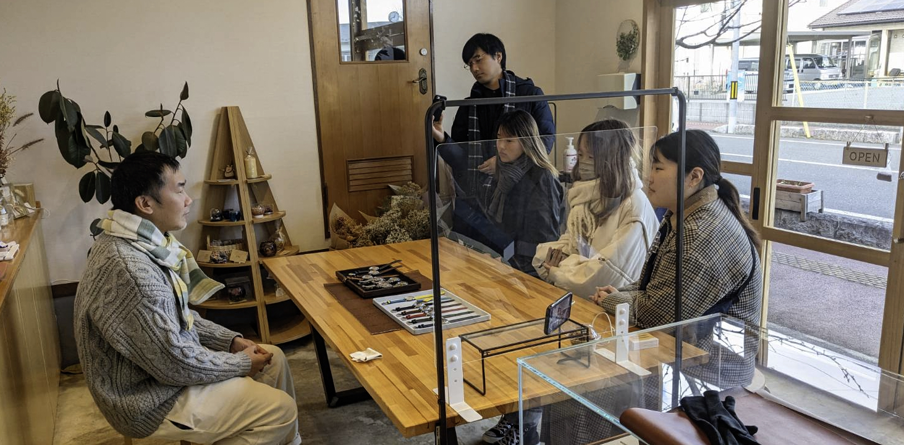

# Saki

## What did you do?

- 2/1　初日は請戸小学校に参加者全員で行き、震災遺構として残されてる唯一の小学校を五感で感じ取ることができた。その後双葉屋旅館で「Human Error」という映画を鑑賞し、これからの2日間で現地の方々に行うインタビューをどのように行えば自然体な形で入り込んだお話まで聞けるかなどのレクチャーを受けた。
- 2/2　二日目は午前中、参加型ワークショップの計画を立てた3人で東日本大震災・原子力災害伝承館を訪れ、資料や展示を拝見した後、語り部の方の講話&インタビューを実施し、複合災害以後伝統文化の継承活動を行っている方にお話を伺うことができた。午後は双葉屋旅館近くにあるブックカフェ「フルハウス」 を訪れ、店長のパートナーである方から、福島県の小高に移住した理由など、貴重なお話を伺うことができた。
- 2/3　自由行動最終日である3日目は、双葉屋旅館近くにある俺たちの伝承館を訪れ、複合災害をアートの観点から見つめ直すことができた。午後はひまわりカフェを訪れ、震災以前からカフェの運営を行っている小高商工会女性部の方にお話を伺うことができた。夜は小高パイオニアビレッジで小高に拠点を置く起業家や町おこしに力を入れている方々との食事会に参加し、様々なバックグラウンドを持った人々が集まる場所で、貴重な体験をすることができた。
	
## What did you achieve?

成果としてはまず物質的な観点として、自分たちのグループでは参加型ワークショップとナラティブを重視した「アナログマッピング」を作成した。アナログマッピングでは、自分たちがここに来て感じたことや好きな場所・感想などを自由に付箋に綴り、可視化しながらこの気持ちを風化させないことができるような空間の提供を行った。その後完成したマッピングを見てrelfectionを行った。最後に自分たちがインタビューをしてきた方々の動画を視聴し、参加者全員で「復興とはなんだろうか」という問いを立て対話を行った。	

今回は本当に自分にとっても新しい気づきが沢山あったFWでした。強いて達成できたかもなあと思うのは、「生きる力」を得たことかな。ここに来て、まず街の方々同士の繋がりがとても強かったのを感じたし、そこで生まれる会話から生まれる前向きなマインドの方々が本当に多い印象を受けた。普段生活しているだけじゃ感じることのできない命の重み、いのちがあるだけで、再チャレンジできるだけでもありがたいと思えることだったりそれでも生きる、ということ。1日1日をbookのpagesのように、大切に生きていくことで自分がわすれていた時間の流れとか結びつきを沢山学んだ気がします。