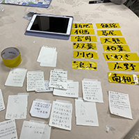
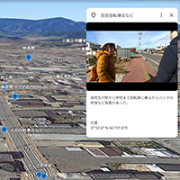
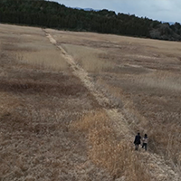

	

		<a href="analog">
			
			
「アナログ版のマッピング作成ーポストイットで想いを伝えよう！ー」

		</a>
	

	

		<a href="miryoku">
			
			
小高の人が持つ魅力

		</a>
	

	

		<a href="omoide_map">
			
			
小高の思い出マップ

		</a>
	

	

		<a href="tsunagari">
			
			
つながり

		</a>
	

	

		<a href="ukedo">
			
			
請度小学校物語を辿る

		</a>
	

