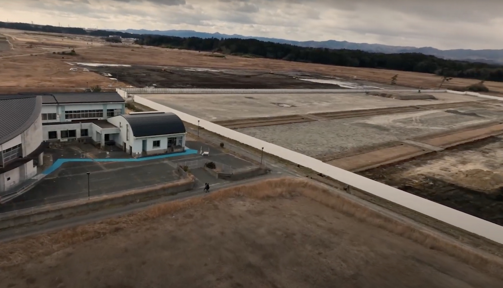

# 請戸小学校物語を辿る

当時の小学生が津波から必死に逃げ切った様子が描かれた本である「請戸小学校物語」を参考に、彼らがどのようにして逃げたのか、実際の経路を辿った。	

請戸小学校の避難ルートを際に歩き動画に残した。 請戸小学校とは 請戸小学校が位置する請戸地区は、津波による死者が127名、行方不明者27人と多くの犠牲が出ました。 海から約300ｍに位置する請戸小学校でも、誰も経験したことのない長い揺れに襲われました。三日目に撮影、編集をし四日目には地元の人たちとプロジェクトのメンバーに発表をした。そこでフィードバックをもらい多くの考えを共有できた。	

## People we met

石崎さん、当時の東電のエピソードが心に沁みた。

希望の牧場の吉澤さん、放射能をあびた牛の写真が衝撃的だった。
    
杉田さん、アーティストの方。『小高の明かり』という小高という地域についての映画や小高で実際に販売している雑誌などを自身で制作している。他にも写真家や絵を描くなど幅広い分野で活躍している。共にプロジェクトの二日目には実際に『小高の明かり』を全員で見た。我々のプロジェクトにも快く協力してくれて、三日目に避難ルートを歩く際はドローンで上空からの映像を撮影してくれた。

  
  
&lt;

  
&gt;

  <!-- Thumbnails will be generated dynamically -->

## Links

[Ukedo Elementary School](https://namie-ukedo.com/)
