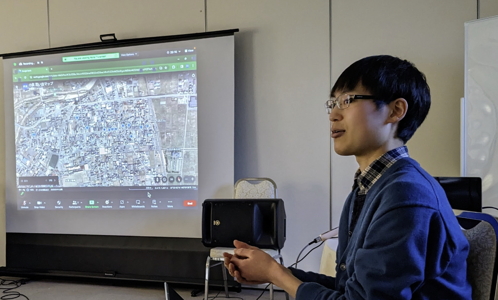

# Akira

## What did you do?

福島県南相馬市小高区及びその周辺地域にて、東日本大震災や原子力災害によってどのような被害を受け、どのように復興・再生が進んでいるのかを他大学の学生8人や引率教員と一緒に学んだ。具体的には地域の商店街をめぐる中で震災前から地域に住んでいる方や震災後に移住してきた方をインタビューし、地域の歴史や特徴、復興に対する思いなどを伺った。とくに、フィールドワーク前半では「復興とはどんな状態か」「小高の未来をどのようにイメージしているか」といった質問を行った。	

## What did you achieve?

南相馬市内だけでも復興の進み具合や復興に対する考え方は地域によって異なることが分かった。今回フィールドワークの拠点となっていた小高区は、全域避難だったものの浪江などよりも避難先が近かったことから、挑戦をする若い移住者が多いことに加えて、行政に頼らず民間で様々な復興事業を進めているのだと考えられる。

また、地域の方の復興観は自分たちと同様に明確に決まっているわけではないようだった。ただ、復興において地域を盛り上げることは大きなウェイトを占めているが、その一方で災害前の状況や災害後現在に至るまでの状況を記憶・記録するための営みも決しておろそかにしてはならないこともひしひしと感じた。自分は街を盛り上げることよりも以前の記憶・記録を残すことに主に貢献したいと考え、地域の方のインタビューで聞いた以前の街の様子やその他の町中のエピソードをgoogle earthを用いてデジタルマップ化した。

地域のたくさんの方から直接声を聴いたことで、ニュースでの報道では分からないような現地の実際の様子を知り感じることが出来た。具体的には人が優しい、ご飯が美味しい、地域の結びつきが強い、地域をどんどん前進させようとする気概が大きいといったことなど。また、一般論からではなく、より現実に即して復興における課題を設定することが可能になり、さらにその課題に対してどのように取り組めばいいのか具体的なイメージが湧くようになったため、その取り組みをプロトタイプではあるものの実現することが出来た。