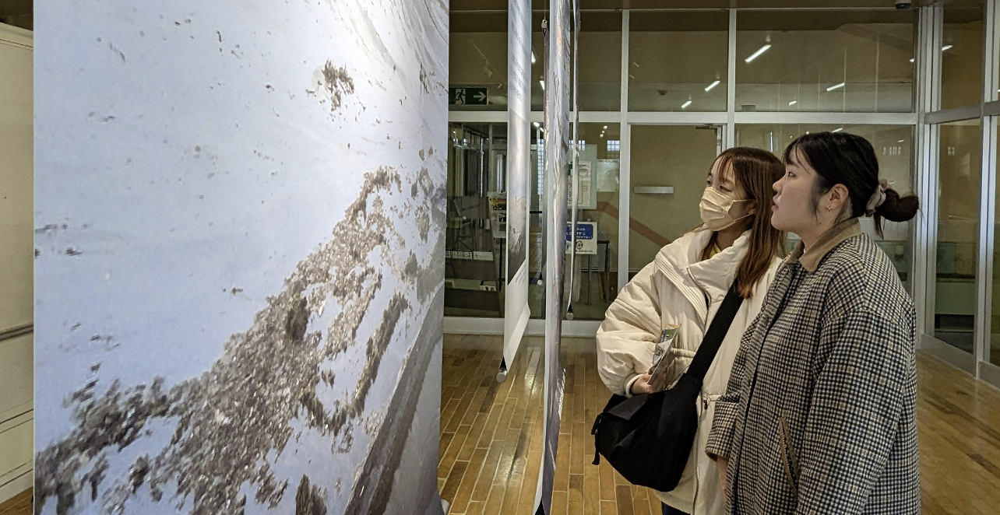

# Mifuyu

## What did you do?

2月1日〜2月4日の4日間福島県浜通り(双葉町、小高町、浪江町）へフィールドワークをした。私は東日本大震災や原発事故で二重災害した街並みに足を運び、五感で感じつつ、人の声にも耳を傾けるために地域の人々との交流やインタビューも行った。	

## What did you achieve?

この4日間で得たものは、3.11の大地震、津波で受けた街や人びとがどれだけ傷を負ったのか、そして被災後に残った者たちと移住してきた者たちの町への愛、思いという復興という言葉だけでは表しきれないものを知れたことだった。私やメンバーを含め、復興という形だけに囚われやすいものがそれだけでは終われない町も人もともにつなぐことの大切さを感じることができ、また震災によって残された負の記憶やモノも忘れてはならないことも思うことができた。	